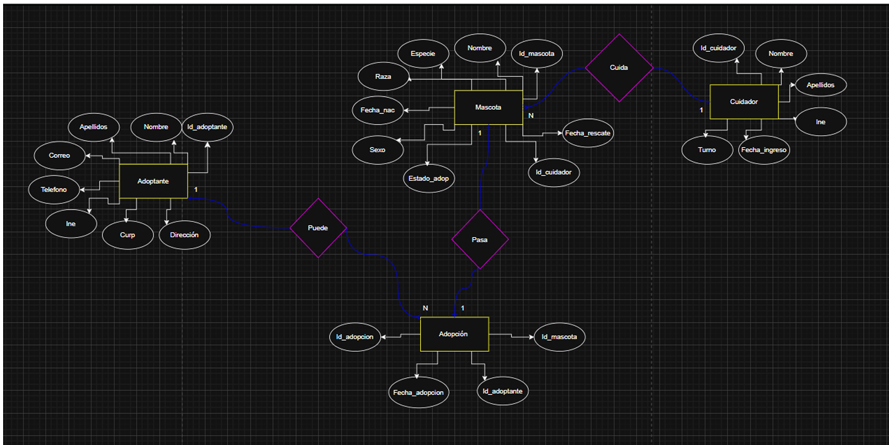
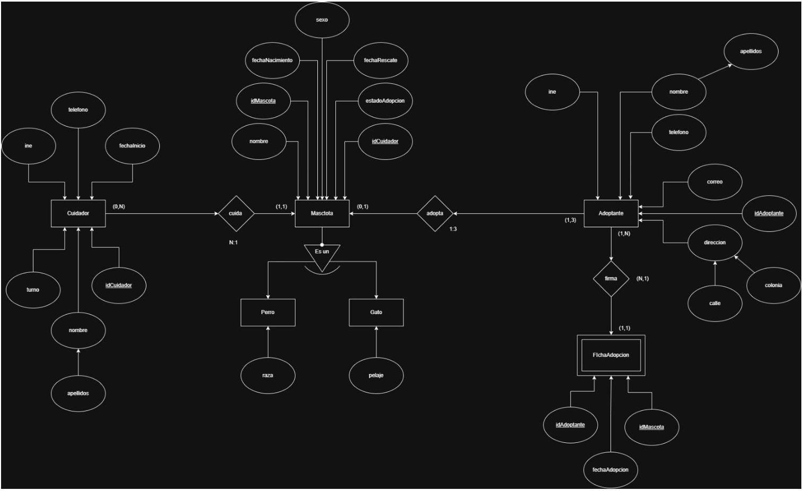
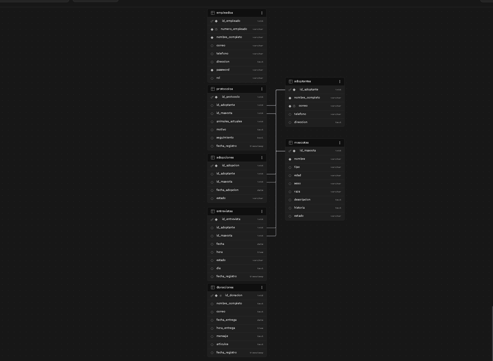

# Proyecto BD_Huellitas

## Sistema Web para la Gestión de Adopciones de Mascotas

### Introducción

BD_Huellitas es un sistema web desarrollado con el propósito de apoyar la gestión de un refugio de animales, permitiendo administrar de manera eficiente los procesos relacionados con la adopción de mascotas. El proyecto surge de la necesidad de digitalizar tareas que normalmente se realizan de forma manual, tales como el registro de adoptantes, la administración de mascotas disponibles, el seguimiento de solicitudes de adopción y la gestión de entrevistas previas a la entrega de los animales.

El sistema busca facilitar la interacción entre los usuarios interesados en adoptar y el personal encargado del refugio, proporcionando una plataforma intuitiva, organizada y segura para ambas partes.

---

# Objetivos del Proyecto

Desarrollar una aplicación web que permita administrar integralmente los procesos de adopción de mascotas dentro de un refugio, garantizando el correcto almacenamiento, consulta y actualización de la información.

---
# 🚨 Problemática

Actualmente, muchos refugios de animales enfrentan dificultades para administrar de manera eficiente la información relacionada con sus mascotas, adoptantes y procesos de adopción. Conforme aumenta la cantidad de animales rescatados y personas interesadas en adoptar, los métodos tradicionales de gestión dejan de ser suficientes para garantizar un control adecuado de la información.

Durante el análisis realizado para el desarrollo de **BD_Huellitas**, se identificaron diversas problemáticas que afectan el funcionamiento diario del refugio:

## 📂 Información dispersa y difícil de administrar

Gran parte de los registros se almacenan en documentos físicos o archivos de Excel, lo que provoca:

- Pérdida de información importante.
- Duplicidad de registros.
- Errores al capturar datos.
- Dificultad para localizar información histórica.

## 🐾 Falta de seguimiento en las adopciones

El refugio necesita conocer en todo momento:

- Qué mascotas están disponibles.
- Cuáles se encuentran en proceso de adopción.
- Cuáles ya fueron adoptadas.
- Quién es el adoptante responsable de cada mascota.

Sin un sistema centralizado, este seguimiento se vuelve lento y propenso a errores.

## 👤 Gestión limitada de adoptantes

Los adoptantes deben proporcionar información relevante para garantizar una adopción responsable. Sin embargo, la falta de organización dificulta:

- Consultar expedientes.
- Ver solicitudes previas.
- Revisar entrevistas realizadas.
- Dar seguimiento posterior a la adopción.

##  Control insuficiente de entrevistas y solicitudes

El proceso de adopción requiere diversas etapas de validación. Sin una plataforma adecuada resulta complicado:

- Registrar solicitudes.
- Programar entrevistas.
- Aprobar o rechazar candidatos.
- Mantener un historial de decisiones.

##  Seguridad y control de acceso

No todos los usuarios deben tener los mismos permisos dentro del sistema.

Se identificó la necesidad de implementar:

-  Administradores con control total del sistema.
-  Empleados con permisos limitados.
-  Protección de información sensible.
-  Control sobre modificaciones y eliminaciones de registros.

---

#  Solución Propuesta: BD_Huellitas

Como respuesta a estas necesidades surge **BD_Huellitas**, una plataforma web diseñada para digitalizar y centralizar la administración completa de un refugio de animales.

El sistema permite:

✅ Gestionar mascotas disponibles para adopción.

✅ Registrar y administrar adoptantes.

✅ Controlar solicitudes y protocolos de adopción.

✅ Programar y administrar entrevistas.

✅ Llevar un historial completo de adopciones.

✅ Gestionar empleados y niveles de acceso.

✅ Mantener toda la información organizada en una base de datos centralizada.

---

# Impacto Esperado

Con la implementación de **BD_Huellitas**, el refugio podrá:

- Reducir errores administrativos.
- Mejorar la organización de la información.
- Agilizar los procesos de adopción.
- Facilitar el seguimiento de cada mascota.
- Incrementar la transparencia en la gestión.
- Promover una adopción más segura y responsable.

**Huellitas** busca convertirse en una herramienta integral que ayude a conectar a los animales rescatados con familias responsables, garantizando un proceso ordenado, seguro y centrado en el bienestar animal.

# Tecnologías Utilizadas

Durante el desarrollo del proyecto se utilizaron diversas tecnologías enfocadas tanto al desarrollo web como al manejo de bases de datos.

## Frontend

### HTML5

Se utilizó para la estructura completa del sistema:

* Landing Page
* Registro de usuarios
* Inicio de sesión
* Galería de mascotas
* Formularios de adopción
* Paneles administrativos

### CSS3

Se empleó para:

* Diseño visual
* Adaptación de colores institucionales
* Organización de elementos
* Tablas administrativas
* Formularios
* Tarjetas de mascotas

### JavaScript

Se utilizó para:

* Validación de formularios
* Navegación entre páginas
* Manipulación del DOM
* Comunicación con Supabase
* Manejo de sesiones
* Almacenamiento temporal mediante LocalStorage

---

## Backend y Base de Datos

### Supabase

Supabase fue seleccionado como plataforma de backend debido a que proporciona:

* Base de datos PostgreSQL
* API REST automática
* Autenticación
* Almacenamiento en la nube
* Escalabilidad

La base de datos principal del proyecto fue implementada en Supabase utilizando PostgreSQL.

---

## Herramientas de Desarrollo

* Visual Studio Code
* Git
* GitHub
* GitHub Pages
* Supabase Dashboard

---
DISEÑO BD HUELLITAS
#1 Proceso de Diseño de la Base de Datos

Uno de los aspectos más importantes del proyecto fue el diseño adecuado de la base de datos.

Antes de crear tablas se realizó un análisis detallado de los procesos que ocurren dentro de un refugio de animales.

Se identificaron las actividades principales:

* Registro de mascotas
* Registro de adoptantes
* Recepción de solicitudes
* Programación de entrevistas
* Gestión de adopciones
* Administración de empleados

A partir de estos procesos se determinaron las entidades principales.

---

# Identificación de Entidades

Después del análisis se definieron las siguientes entidades:

## Mascotas

Almacena información de los animales.

Atributos:

* id_mascota
* nombre
* especie
* raza
* edad
* sexo
* estado
* descripcion
* fotografia

---

## Adoptantes

Almacena información de las personas interesadas en adoptar.

Atributos:

* id_adoptante
* nombre_completo
* correo
* telefono
* direccion
* motivo_adopcion
* acepta_seguimiento

---

## Solicitudes

Representa cada petición de adopción realizada.

Atributos:

* id_solicitud
* id_adoptante
* id_mascota
* fecha
* estado

---

## Entrevistas

Permite registrar entrevistas previas a la adopción.

Atributos:

* id_entrevista
* id_adoptante
* id_mascota
* fecha
* hora
* estado

---

## Adopciones

Registra adopciones aprobadas o rechazadas.

Atributos:

* id_adopcion
* id_adoptante
* id_mascota
* fecha_adopcion
* estado

---

## Empleados

Contiene los usuarios administrativos del sistema.

Atributos:

* id_empleado
* numero_empleado
* nombre_completo
* correo
* direccion
* password
* rol

---

# Diseño del Modelo Entidad Relación (ER)

Una vez definidas las entidades se procedió a construir el Modelo Entidad Relación:

## 📊 Modelo Entidad Relación (ER)

  

---

# Diseño del Modelo EER

Posteriormente se extendió el modelo ER para obtener un Modelo Entidad Relación Extendido (EER).

## 📈 Modelo Entidad Relación Extendido (EER)

  

# Modelo Relacional

Después del diseño conceptual se transformó el modelo a tablas relacionales.

Las principales tablas fueron:

## 🔗 Modelo Relacional

  

* mascotas
* adoptantes
* solicitudes
* entrevistas
* adopciones
* empleados

Cada tabla cuenta con:

* Clave primaria
* Claves foráneas
* Restricciones de integridad
* Relaciones normalizadas

---

# Funcionalidades del Sistema

## Landing Page

Presenta información general del refugio y fomenta la adopción responsable.

---

## Registro de Adoptantes

Permite que nuevos usuarios creen su perfil dentro del sistema.

---

## Inicio de Sesión

Permite autenticación de empleados mediante número de empleado y contraseña.

---

## Galería de Mascotas

Muestra mascotas disponibles para adopción.

Incluye:

* Fotografías
* Información básica
* Estado de adopción

---

## Detalle de Mascota

Presenta información completa de cada animal.

---

## Protocolo de Adopción

Recopila:

* Dirección
* Teléfono
* Número de animales actuales
* Motivo de adopción
* Aceptación de seguimiento

---

## Panel Administrativo

Permite gestionar:

* Mascotas
* Adoptantes
* Solicitudes
* Empleados
* Entrevistas
* Adopciones

---

## Gestión de Solicitudes

Los administradores pueden:

* Aprobar solicitudes
* Rechazar solicitudes
* Consultar historial

---

## Gestión de Entrevistas

Los administradores pueden:

* Programar entrevistas
* Aprobar entrevistas
* Rechazar entrevistas

---

## Gestión de Empleados

Permite:

* Registrar empleados
* Editar empleados
* Eliminar empleados
* Asignar roles

---

# Arranque Local del Proyecto

Para ejecutar el proyecto localmente se siguieron los siguientes pasos:

1. Instalar Visual Studio Code.
2. Descargar el proyecto desde GitHub.
3. Abrir la carpeta del proyecto.
4. Instalar la extensión Live Server.
5. Ejecutar el archivo index.html.
6. Abrir el navegador automáticamente.
7. Verificar la conexión con Supabase.

---

# Despliegue en GitHub Pages

El sistema fue publicado utilizando GitHub Pages.

Proceso:

1. Crear repositorio en GitHub.
2. Subir archivos HTML, CSS y JavaScript.
3. Configurar GitHub Pages.
4. Seleccionar rama principal.
5. Publicar el proyecto.
6. Obtener URL pública.

Esto permitió que cualquier usuario pudiera acceder al sistema desde internet.

---

# Ventajas de Huellitas Frente a Otras Plataformas

Existen numerosos sitios enfocados a la adopción de mascotas; sin embargo, Huellitas ofrece diversas ventajas.

## Gestión Integral

No solo muestra mascotas.

También administra:

* Solicitudes
* Entrevistas
* Adopciones
* Empleados
* Seguimiento
Además de buscar priorizar la seguridad e integridad de cada animalito que salga del refugio.

---

## Facilidad de Uso

La interfaz fue diseñada para ser intuitiva y comprensible incluso para usuarios sin experiencia tecnológica.

---

⭐ ¿Por qué elegir Huellitas?

Huellitas no es únicamente una página para mostrar mascotas. Es una plataforma pensada para administrar de forma completa el proceso de adopción.

A diferencia de otros sitios simples de adopción, Huellitas permite:

Registrar mascotas.
Consultar adoptantes.
Gestionar solicitudes.
Programar entrevistas.
Controlar adopciones.
Administrar empleados.
Registrar donaciones.
Dar seguimiento al proceso.

Además, el sistema prioriza la seguridad e integridad de cada animalito que sale del refugio. La adopción no se maneja como una simple publicación, sino como un proceso responsable con validación, entrevista y seguimiento.

Esto convierte a Huellitas en una solución más completa, ordenada y confiable para refugios que necesitan digitalizar sus procesos.
Prueba de usuario admnistrador:

Usuario: EMP-0042 Contraseña: 1234
Repositorio general: https://github.com/gabrielhuav/DB-Coursework-2026-2
